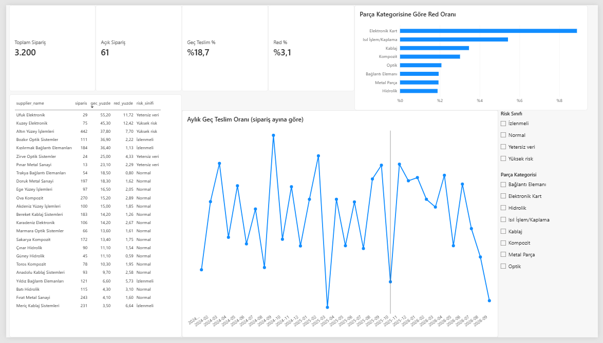
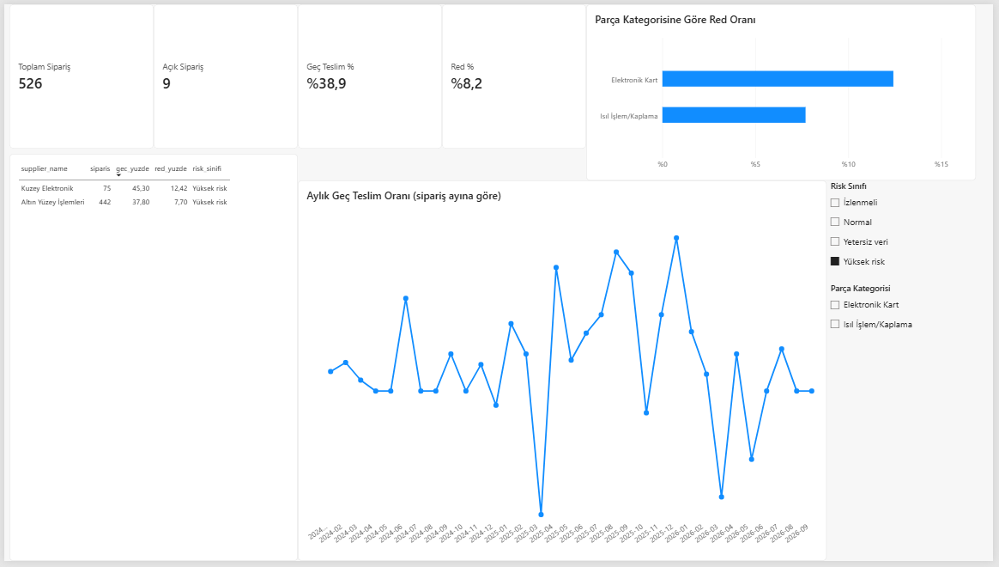

# Tedarik ve Kalite Analizi: SQL + Power BI

**Araçlar:** PostgreSQL, SQL (CTE, pencere fonksiyonları), Power BI, Python (veri üretimi)

Parça tedarikçilerinin teslimat performansını ve kalite red oranlarını ilişkisel bir veritabanında analiz eden, sonuçları Power BI dashboard'una aktaran bir proje.



## Önemli not: veri kurgusaldır
Gerçek tedarik verisi herkese açık olmadığı için tüm veri `generate_data.py` ile **sentetik olarak üretilmiştir**. Tedarikçi adları kurgusaldır ve gerçek firmalarla ilgisi yoktur. Veriyi üretirken bazı tedarikçilere bilerek farklı davranışlar (geç teslim eden, kalitesiz, ikisi birden) verdim; bu yüzden aşağıdaki bulgular **gerçek dünyayı değil, bu veri setini** anlatır. Amaç, SQL analiz yöntemini ve dashboard kurulumunu göstermektir.

## Problem
Savunma ve havacılık gibi sektörlerde tedarik zincirinde iki soru kritiktir:
- Hangi tedarikçiler teslimatı geciktiriyor?
- Hangi tedarikçi ve parça kategorilerinde kalite sorunu yoğunlaşıyor, ve bu iki sorun birlikte mi görülüyor?

## Veri modeli
Beş tablo (PostgreSQL):

| Tablo | İçerik | Satır |
|---|---|---|
| `suppliers` | Tedarikçi, ülke, şehir, ana kategori | 24 |
| `parts` | Parça kodu, adı, kategori, standart maliyet | 120 |
| `orders` | Sipariş, söz verilen teslim tarihi, adet, birim fiyat | 3.200 |
| `deliveries` | Gerçekleşen teslim tarihi ve adet (açık siparişin teslimatı yoktur) | 3.139 |
| `quality_inspections` | Kontrol edilen ve reddedilen adet, red nedeni | 3.139 |

61 sipariş açıktır (veri kesim tarihi: 2026-09-30). Şema `schema.sql` içindedir; birincil/yabancı anahtarlar ve `CHECK` kısıtları tanımlıdır.

## Analiz ve bulgular
Sorgular `queries.sql` içinde, her biri ilgili soruyla birlikte yorumlanmıştır (Q1-Q12). Kullanılan başlıca yapılar: `JOIN`, `GROUP BY / HAVING`, `FILTER`, CTE, `LAG`, `RANK`, `ROW_NUMBER`, kümülatif toplam, `LEFT JOIN ... IS NULL`.

Bu veri setindeki sonuçlar:
- **Genel:** Teslim edilen siparişlerin %18,7'si söz verilen tarihten geç gelmiş, kontrol edilen adetlerin %3,1'i reddedilmiş.
- **Yüksek riskli tedarikçiler** (gecikme ≥ %30 ve red ≥ %5): **Kuzey Elektronik** (%45,3 gecikme, %12,42 red) ve **Altın Yüzey İşlemleri** (%37,8 gecikme, %7,70 red).
- **Tek sorunu olanlar:** Bozkır Optik Sistemler ve Kızılırmak Bağlantı Elemanları geç ama redi düşük; Yıldız Bağlantı Elemanları ve Meriç Kablaj zamanında ama redi yüksek.
- **Yetersiz veri:** 30'dan az teslimatı olan tedarikçiler (ör. Ufuk Elektronik, 29 teslimat, %55,2 gecikme) küçük örneklem nedeniyle sınıflandırılmadı. Ham oran çok yüksek görünse de bu az sayıya dayanıyor.
- **Kategori:** En yüksek red oranı Elektronik Kart'ta (%8,88, en sık neden: fonksiyon testi), sonra Isıl İşlem/Kaplama (%5,42) ve Kablaj (%3,46).
- **Gecikme ve red ilişkisi:** Zamanında gelen teslimatlarda red %2,94, 15+ gün geciken teslimatlarda %6,78. (Veriyi üretirken geç gelen teslimatlarda red olasılığını artırdığım için bu ilişki bilerek vardır.)
- **Eksik teslimat:** 193 teslimatta gelen adet sipariş edilenden azdır.

## Dashboard
Power BI dashboard'u, `v_order_facts` ve `v_supplier_scorecard` görünümlerine PostgreSQL'den bağlanır (`views.sql`). Dört kart (toplam sipariş, açık sipariş, geç teslim %, red %), tedarikçi karnesi tablosu, aylık geç teslim çizgisi, kategoriye göre red oranı çubuk grafiği ve risk sınıfı / kategori dilimleyicileri içerir.



Dilimleyici ile "Yüksek risk" seçilince tablo iki tedarikçiye iner, kartlar ve grafikler birlikte güncellenir. Kartlardaki toplam sipariş (526), tedarikçi tablosundaki teslimat sayısının (75 + 442 = 517) ve açık siparişlerin (9) toplamıdır.

`dashboard/` içindeki `.pbix` dosyası yerel (`localhost`) bir PostgreSQL veritabanına bağlıdır; verileri yenilemek için aşağıdaki kurulumu yapmak gerekir.

## Çalıştırma
1. PostgreSQL kurun ve `tedarik_kalite` adlı bir veritabanı oluşturun.
2. Verileri üretin (repoda hazır CSV'ler de vardır):
```
pip install -r requirements.txt
python generate_data.py --out data
```
3. Tabloları ve verileri yükleyin (proje klasöründe):
```
psql -U postgres -d tedarik_kalite -f schema.sql
psql -U postgres -d tedarik_kalite -f load_data.sql
psql -U postgres -d tedarik_kalite -f views.sql
```
4. `queries.sql` içindeki sorguları çalıştırın, `dashboard/` içindeki Power BI dosyasını açın.

## Sınırlılıklar
- Veri sentetiktir; bulgular gerçek dünyaya genellenemez.
- Risk eşikleri (%30 gecikme, %5 red, en az 30 teslimat) örnek amaçlı seçilmiştir, gerçek maliyete göre ayarlanmamıştır.
- Aylık gecikme grafiğinde son aylar (2026-08, 2026-09) yanıltıcıdır: o aylarda verilen siparişlerin geciken kısmı henüz teslim edilmediği için oran yapay olarak düşük görünür.
- Kontrol edilen adet büyük partilerde örneklemedir (%20), tüm adet değildir.
